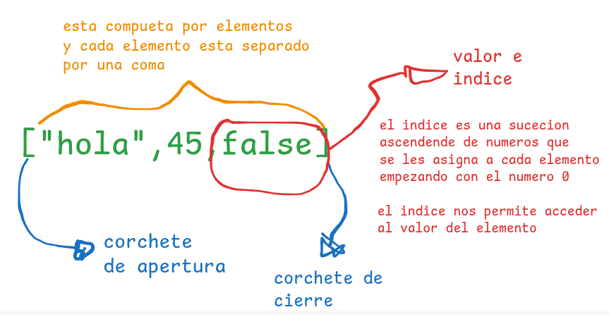
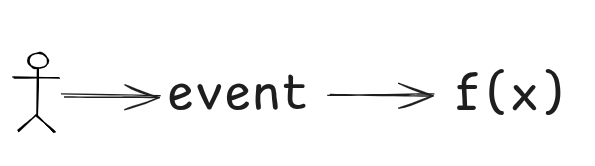

# Taller de Repaso de JavaScript
>[!WARNING] Observación:
Quokka se debe ejecutar en cada archivo.

>[!TIP] 
Quokka detecta que en nuestro proyecto tenemos node.js y lo ejecuta para poder ver la consola en vivo.
## 1. Tipos de datos
Es la manera como capturamos información, en JavaScrip se clasifica en 2 grandes grupos:
>[!TIP]
JavaScript tiene funciones predeterminadas, por ejemplo, para mostrar un mensaje por consola `console.log()`.
Para poder verificar que tipo de dato estamos manejando en JavaScript también tenemos una función por defecto, llamada typeof `typeof()`.
### Primitivos:
Son datos que siempre han existido.
1. Númericos:
   - Enteros Positivos
   - Enteros Negativos
   - Decimal Positivo
   - Decimal Negativo 
   - NaN (Not a Number)
2. Texto
   - Caracteres
   - Caracteres especiales
   - String
3. Booleanos
   - True  - 1
   - False - 0
### Estructurados:
1. Array (Listas)
   - Array de tipo numérico
   - Array de tipo string
   - Array de tipo mixto
- ¿Cómo está estructurado? 
  
1. Objetos (Diccionario): 

   Son similares a las listas con la única diferencia que en vez de tener valor e índice, sus elementos trabajan con `clave:valor`
- ¿Cómo está estructurado? 
  
## 2. Variables (enlaces, binding)
Es la técnica que se usa para poder apuntar a una dirección en memoria y al valor o dato relacionado ó que se encuentre almacenado en ese momento.
Tenemos 2 pasos para crear una variable.
- Primero declarar la variable/constante.
- Segundo inicializar la variable/constante.

**Observación**
Para crear la variable, primero tenemos que crear el enlace luego darle el nombre de la variable/constante:
Para las palabras reservadas `keyword`- `let`, `var`.
Para las constantes tenemos la palbra reservada `keyword`-`const`
**Recomendaciones**
- `let`: Usar cuándo el valor tendrá que variar.
- `var`: Evitar usar
- `const` Usar cuándo el valor será el mismo siempre.
  `let` y`var` ambos nos permite crear variables su única diferecia es el alcance, ámbito o `scope`.
## 3. Operadores
Su clasificación general se divide en 3:
   1. Operadores unarios:
   Los operadores unarios son aquello que se ubican a la izquierda del valor y que dan como resultado un nuevo valor.
   2. operadores binarios:
    Los operadores binarios son aquellos que están en medio de dos valores y que retornan un único valor.
   - Operadores Aritméticos
   - Operadores de comparación 
   - Operadores lógicos
   1. Operadores ternarios:
   LOs operadores terciarios son aquellos que evalúan tres valores y que retornan un solo valor.
## 4. Controles de flujo
Nuestros programas en JavaScript contiene más de una sentencia y las sentencias son ejecutadas una a una como si fuera una historia, de arriba hacia abajo como un camino recto.
### Control de decisión(If)
JavaScript nos permite crear caminos alternativos en nuestros programasdependiendo de una decisión, a esto se le conoce como caminos o ejecución condicional, que ejecutará a una sentencia u otra teniendo en cuenta la condición, así podemos crear múltiples caminos u opciones en nuestros programas.
Si se tiene una condición verdadera se ejecutará una sentencia, si tenemos una condición false se ejecutará otra sentencia totalmente distinta.

**Observación**
La ejecución condicional rompe el flujo normal de un programa.
### Bucle(for)
Crea un bucle que consiste en tres expresiones opcionales, encerradas en paréntesis y separadas por puntos y comas, seguidas de una sentencia ejecutada en un bucle.

Sintaxis
for ([expresion-inicial]; [condicion]; [expresion-final])sentencia

`expresion-inicial`
Una expresión (incluyendo las expresiones de asignación) o la declaración de variable. Típicamente se utiliza para usarse como variable contador. Esta expresión puede opcionalmente declarar nuevas variables con la palabra clave var. Estas variables no son locales del bucle, es decir, están en el mismo alcance en el que está el bucle for. El resultado de esta expresión es descartado.

`condicion`
Una expresión para ser evaluada antes de cada iteración del bucle. Si esta expresión se evalúa como verdadera, se ejecuta sentencia. Esta comprobación condicional es opcional. Si se omite, la condición siempre se evalúa como verdadera. Si la expresión se evalúa como falsa, la ejecución salta a la primera expresión que sigue al constructor de for.

`expresion-final`
Una expresión para ser evaluada al final de cada iteración del bucle. Esto ocurre antes de la siguiente evaluación de la condicion. Generalmente se usa para actualizar o incrementar la variable contador.

`sentencia`
Una sentencia que se ejecuta mientras la condición se evalúa como verdadera. Para ejecutar múltiples sentencias dentro del bucle, utilice una sentencia block ({ ... }) para agrupar aquellas sentecias.
### Bucles(While)  
Crea un bucle que ejecuta una sentencia especificada mientras cierta condición se evalue como verdadera. Dicha condición es evaluada antes de ejecutar la sentencia.

Sintaxis
while (condicion)
  sentencia

`condición`
Una expresión que se evalúa antes de cada caso de bucle. Si esta condición se evalúa como true, se ejecuta sentencia. Cuando la condición se evalúa como false, la ejecución continúa con la sentencia posterior al bucle while.

`sentencia`
Una sentecia que se ejecuta mientras la condición se evalúa como verdadera. Para ejecutar múltiples sentencias dentro de un bucle, utiliza una sentencia block ({ ... }) para agrupar esas sentencias.

## 5. Funciones
## 6. Métodos para trabajar con datos estructurados:
Los métodos son funciones que dan funcionalidades extras a los tipos de datos, en los cuales se aplica:
- Un método es antecedido por un tipo de dato y un punto.
   **Ejemplo**
   El ejemplo más claro de un método es el `length`, este método nos permite o nos retorna la cantidad de caracteres de un string o la cantidad de elementos de una lista.
```js
   "hola".length //4
   [2,5,4,6,7].length // 5
```
>[!TIP]
Los métodos en su mayoría solo se aplican a tipo de datos string, listas y objetos, en su gran parte son aplicados para listas.

### 6.1. Métodos para string - cadenas de texto
#### - length: 
Devuelve la logitud de una cadena.
```js
let mensaje="hola cómo estás"
console.log(mensaje.length())
//retorna =>15
```
#### toLowerCase:
devuelve una cadena en minúsculas.
```js
let texto="HOLA"
console.log(texto.toLowerCase())
//retorna ->"hola"
```

#### toUpperCase:
devuelve una cadena en mayúsculas.
```js
let texto="hola"
console.log(texto.toUpperCase())
//retorna ->"HOLA"
```

#### concat:
Combina el texto de dós o más cadenas.
```js
let nombre="Kcapa"
let saludo="Hola"
//let concatenado=saludo+nombre
let cad1="Hoy"
let cad2="es"
let cad3="jueves"
console.log(cad1.concat(cad2,cad3))
//retorna -> Hoy es jueves
```

#### trim:
Este método elimina los espacios que existen al inicio o final de una cadena o texto.
```js
let texto="  hola"
let nuevoTexto=texto.trim()  //hola
let otroTexto="hola    "
let nuevoOtroTexto=otroTexto.trim() //hola
```

#### slice: 
Este método nos permite extraer partes de una cadena, especificando sus índices, donde comenzar y hasta dónde mostrar.
```js
let párrafo=" Hola, soy Percy"  //Solo se quiere mostrar el nombre
let nombre=párrafo.slice(9) //Percy
let soy=párrafo.slice(5,8) 
```

#### split:
Este método retorna una lista basándose en un separador que se le indique.
```js
let párrafo=" Solo sé que nada sé"
párrafo.split(" ") //["solo","sé"."que"."nada"."sé"]
let url="google.com/search?=gatitos"
let gatito=url.split("=") //["google.com/search?"."gatitos"]
console.log(gatito[1]) //gatitos
let listaFrutas="manzanas,naranja,pera,fresa"
listaFrutas.split(",")
```

### 6.1. Métodos para listas - arrays

#### Crear una lista
```js
let lista=[]
```

#### Agregando elementos a una lista:
```js
lista[0]="manzana"
```
#### push:
El método `push` agrega elementos al final de una lista.
```js
let lista=[]
lista.push=("manzana")
```
#### unshift;
El método `unshift` agrega elementos al inicio de una lista
```js
let amigos=['Ronny','Lisbet']
amigos.unshift('Ronal')
```
#### Remover elementos de una lista: 
#### Pop:
El método `pop` al contrario de push, extrae el útimo elemento de una lista.

#### shift:
El método `shift` al contrario de unshift extrae el primer elemento de la lista.

#### Eliminar elementos de una lista:
#### delete:
Elimina un elemento en base a su índice.
```js
let texto=["Es","una","","oración"]
delete texto[2]
```
#### splice:
Este método elimina el elemento en base a su índice y a la cantidad de elementos a eliminar.
```js
let vocales=['a','e','i','o','u']
vocales.splice(2,1)
```

#### Combinando y uniendo listas(arrays)
#### concat:
Este método crea un nuevo array que contienen los elementos del array original seguido por los elementos de uno o más arrays proporcionados.
```js
let amigoPrimaria=['amigo1','amigo2','amigo3','amigo4']
let amigoSecundaria=['amigo5''amigo6']
let amigoSuperior=['amigo7''amigo8']
```


#### Métodos para iterar elementos:
#### forEach:
Este método ejecuta una función anónima por cada elemento.
```js
let numeros=[1,2,3,4,5,6]
numeros.forEach(n=>{console.log(n+1)})
```
#### map:
Este método ejecuta una función anónima por cada elemento de un array, generando una nueva lista
```js
let numeros=[1,2,3,4,5,6]
numeros.map(n=>{})
```

#### Métodos para buscar elementos en una lista:
#### includes:
Este método busca un valor específico y devuelve un valor buscado, retorna true, caso contrario false.
```js
let vocales=['a','i','o','u']
let buscaE=vocales.includes('e')
//retorna false
let buscaA=vocales.includes('a')
//retorna true
```

#### filter:
Este método se usa para encontrar elementoa dentro de una lista que cierta condición.
```js
let numeros=[3,5,84,2,4,24,1,0]
//Deseo una lista con los numeros que sean menor de 4
let nuevoNumero=numeros.filter(n=>{n<4})
```

#### find:
Este método se utiliza para encontrar el primer elemento que cumpla con cierta condición, a diferencia del `filter` solo retorna un elemento el que coincida con la condición.
```js
let lisNumeros=[10,13,15,17]
//Devolver el número menor de 10
let menorDiez=lisNumeros.find(n=>{return n>10})
console.log(menorDiez)
```

### 6.2 Métodos para objetos
#### Creando un objeto:
```js
//objeto o diccionario vacío
let objeto=[]
```

#### Agregando elementos a un objeto:
Recuerden que el elemento de un objeto está conformado por `clave;valor`.
```js
objeto["nombre"]="ruth"
objeto["edad"]=19
objeto[CUI]=92849202
```

#### Actualizando elementos de nuestro objeto:
Para realizar la actualización del valor de un elemento tenemos que acceder a travez de su clave y asignarle el nuevo valor.

**Observación:**
La clave debe de ser la misma a actualizar de no existir, se crea uno nuevo.
```js
objeto["edad"]=19
```

#### Eliminando un elemento de nuestro objeto:
Para eleiminar el elemento de un objeto, hacemos uso de un operador unario `delete`.
```js
delete objeto.CUI
```


Los datos estructurados suelen almacenarse en archivos, por ello es fundamental organizar y acceder correctamente a ellos para realizar operaciones.
### Acceder: 
Obtener la información almacenada dentro de un archivo para leer o consultar datos, puede hacerse mediante lectura secuencial o acceso directo según la estructura del archivo.
### Modificar:
Cambiar los datos existentes dentro de un archivo, habitualmente localizando primero el registro y luego actualizando alguno de sus campos.
### Crear:
Generar un archivo nuevo dónde se almacenarán datos estructurados. Esto implica definir el formato o estructura de los registros dentro del archivo.
### Insertar: 
Añadir nuevos registros al archivo, en ocasiones respetando un orden o secuencia, según el tipo de archivo.
### Eliminar:
Quitar uno o varios registros del archivo. Esto puede implicar la búsqueda previa del registro que se quiere eliminar.
### Ordenar:
Reorganizar los registros dentro del archivo basándose en un campo clave para facilitar búsquedas y análisis posteriores.


### Scope en `let` y `var`:
El *scope* o ámbito en programación es el contexto o región del código donde una variable, función o dato es accesible y puede ser utilizado. Define que partes del programa *ven* o pueden acceder a esa entidad.
Hay varios tipos principales de scope:
  
- *Global*: La variable está definida fuera de funciones o bloques y pueden usarse en cualquier parte del código.
- *Local*: La variable existe solo dentro de una función o bloque dónde fue declarada, inaccesible fuera.
- *De bloque*: Alcance limitado al bloque (`{}`) más próximo, introducido con `let` y `const` en JS.

`var` y `let`:
- *var* tiene scope de función: La variable existe a lo largo de toda la función que lo contiene.
- *let* tiene scope de bloque: La variable solo existe dentro del bloque `{}` donde fue declarada, lo que ayuda a evitar errores por redefiniciones o accesos inoportunos.

## 7. es6
### Arrow function
### Destructuring:
Esta es una técnica para el desempaquetado de listas u objetos en variables, esta técnica facilita el acceso a los elementos de una lista u objeto.
```js
let alumno={
   "nombre":"Miguel",
   "edad":"17"
}
console.log(alumnpo.nombre)
//desetructuración
```

## DOM (Document Object Model):
- Según sus siglas es Modelo de Objeto de Documento.
- Pa ra la web es una API del navegador, eso significa que nos proporciona una interfaz para comunicarnos entre HTML y JavaScript .
- Según su funcionalidad DOM es el encargado de convertir documentos `html` y `css` en objetos de `JavaScript` o en un árbol de objetos.
- Para `JavaScript` el `DOM` es un objeto con el que podemos leer y modificar a nuestro antojo.
  
La manera en como `DOM` nos permite interactuar con nuestros documentos `html` y `css` son a través de `selectores`.

### Selectores:
Es la manera de como podremos manipular el `DOM`, este es el primer paso que debemos dominar para realizar operaciones de lectura o modificaciones,

#### Captura de elementos:
##### Selectores Tradicionales
Estos selectores son métodos del documento, porque `DOM` trabaja con el documento.

```js
//--selesctores por id:
document.getElementById("mi_div")
//<section id=mi_div></section>
//--Selectores por atributo_name:
//<input name="dni" value="323">
//dni="323"
document.getByName("dni")
//todos los elementos
//--Selectores por su etiqueta tag
//<h1></h1>
document.getElementTagName("h1")
//-- Selectores por su clase:
//<div class=rojo></div>
document.getElementByClassName("rojo")
```
  
  >[!tip]
  En la programación web `DAW` se hace el uso de dos técnicas, 1. Obtención de datos (get), 2. Creación de Datos (set), Setter and getter.  

##### Selectores Modernos oAvanzados:
```js
//Para la captura de un elemento ó el primer elemento que coincida con la búsqueda
document.querySelector()
//Busca y obtiene el elemento que coincida con el nombre de la clase.
documnet.querySelector("nombre_clase")
//Busca y obtiene el elemento que coincida con el nombre de la id.
document.querySelector("nombre_id")
//Busca y obtienen el elemento que coincida con el nombre de la etiqueta
document.querySelector("p")
document.querySelector(".input[name=""id]")

//Para acceder a todas las coincidencias.
//Esto retorna un array con todas las coincidencias.
document.querySelectorAll("nombre_clase")
```
#### Acceder, actualizar contenido y crear y remover atributos :
Una vex capturada elemento con `querySelector` pueden hacer uso de `textContent` para acceder al contenido del elemento, de esta misma forma podemos editaro actualizar el conyenido  ` textContent="hola"` esto es lo que actualiza el contenuido anterior con el contenido que se le está asignando.
`textContent` solo se usa si deseamos agrgar contenido de tipo texto, si deseamos setear o agrgar contenido de tipo `html` se deberá usar `innerhtml`.
```js
//<p id="text"> Este es un contenido</p>
let etiquetaP=document.querySelector("#text")
console.log(etiquetaP,textContent)
//Este es un contenido
etiquetaP.textContent="nuevo texto"
console.log(etiquetap.textContent)
//nuevo texto

//<div id="contenedor"></div>
let div=document.querySelector("#contenedor")
div.innerHTML="<p> este es un párrafo</p>"
``` 

Una vez ya conocido la forma de capturar elementos `html` y la forma de setear contenido(`textContent`) y html (`innerHTML`), también podemos setear atributos y removerlos.
```js
//<div>contenido</div>
//data-description
let contenido=document.querySelector("#contenido")
//Entre paréntesis van dos parámetros, primero el nombre del atributo a crear y el segundo el valor que debe tener.
contenido.setAtribute("data-description","valor de mi data_description")
//<div id="contenido" data-description="valor de mi data-description">contenido</div>

//eliminar el atributo creado
//entre paréntesis el nombre del atributo que se va a elimminar
contenido.removeAtribute("data-desription")
```

#### Agregar y Eliminar Elementos:
Para crear un nuevo elemento no necesitamos capturar un elemento por que crearemos un elemento nuevo, realizamos lo siguiente:
```js
//entre los paréntesis la etiqueta que se va a crear.
let nuevoEtiquetaP=document.createElement("p")
//agregar contenido a mi nueva etiqueta
nuevoEtiquetaP.textContent="información en el párrafo"

//para que esta información aparezca de manera visible en mi html, debemos agregarlo a un elemento padre.
/*
<body></body>
*/
let body=document.querySelector("body")
//Hacer uso del método que me permite asignarle nuevos hijos.
body.appendChild(nuevoEtiquetaP)

//Deseo eliminar ese elemento que acabo de crear
//Usamos el nombre del elemento a eliminar y luego usamos el método remove()
nuevoEtiquetaP.remove()
```

### Modificar Clases y Estilos
Estos métodos que veremos a continuación nos permitirá cambiar de manera interactiva los estilos CSS que se puedan aplicar a ciertos elementos, pero haciendo uso de JavaScript y logrando sus cambios de estilo de manera dinámica.
Con estos métodos agregamos clases que existan.
- Archivo **Index.html**
```html
<!--DOCTYPE html head-->
<body>
   <section id="principal"></section>
</body>
<!---->
```

- Archivo **style.CSS**
```css
.color-fondo-rojo{
   background-color:red;
}
```

- Archivo **script.js**
```js
//agregar a mi section el fondo rojo
let section=document.querySelector("#principal")
section.classList.add("color.fondo.rojo")

//Eliminar la clase
section .classList.remove("color-fondo-rojo")

//Crear estilos directamente
section.style.backgroundColor="red"
```

### Eventos(tarea-Averiguar)
Los eventos son sucesos o acciones que ocurren en un momento temporal en JS, DOM y en nuestro navegador. Cuando abrimos una página web y el usuario interactúa con la web se produce estos eventos.
Estos ocurren sobre elementos `html` o elementos del `DOM`, estos eventos son lo que le da vida a la página web, realizar acciones cuando el usuario interactúe con ella.

- Listeners: Es una función que nos permite escuchar un evento y ejecutar código cuando ese evento ocurra, el código que se ejecuta se llama `handler`.
Es decir, listener es el que escucha y handler es el que ejecuta una función cuando ocurre ese evento.
   - Primera manera(no recomendado): Atributo html
       ```html
       <button onclick="alert(`hola`)">Click aquí</button>
       ```
   - Segunda manera: Propiedad del DOM
      ```js
      const button =document.querySelector(`button`);
      button.onclick =function(){
         alert(`hola desde javascript`);
      }
      ```
   - Tercera manera: addEventListener (Recomnedado)
      ```js
      button.addEventListener(`click`, function(){
         alert(`hola con addEventListener`);
      });
      ```

addEventListener nos permite más control sobre la propagación, mejor organización del código, puede removerse fácilmente y permite múltiples funciones para el mismo evento.

- DOMContentLoaded:
Es un evento que se dispara cuando el HTML está completamente cargado, sin esperar imágenes ni recursos externos.
```js
document.addEventListener('DOMContentLoaded', function() {
    // Aquí el DOM está listo y seguro para manipular
    const button = document.getElementById('miBoton');
    button.addEventListener('click', function() {
        alert('¡Todo funciona correctamente!');
    });
});
```
 Debería de ser usado porque evita errores al amnipular elementos que aún no existen y garnatiza que el código se ejecute en el momento correcto.

- Evento Submit en Formularios:
Se dispara cuando un formulario es enviado, permitiendo validar datos antes del envío.
```js
const form = document.getElementById('miFormulario');
form.addEventListener('submit', function(event) {
    event.preventDefault(); // Detiene el envío normal
    
    // Validación personalizada
    const email = document.getElementById('email').value;
    if (!email.includes('@')) {
        alert('Email inválido');
        return;
    }
    
    // Si todo está bien, procesar el formulario
    console.log('Formulario válido, enviando datos...');
});
```

---

- Eliminar Comportamiento Nativo:
   - preventDefault(): Detiene la acción por defecto del navegador:
```js
// Evitar que un link navegue
link.addEventListener('click', function(event) {
    event.preventDefault();
    console.log('Link clickeado pero no navega');
});

// Evitar envío de formulario tradicional
form.addEventListener('submit', function(event) {
    event.preventDefault();
    // Manejar envío manualmente
});
```

   - stopPropagation(): Evita que el evento se propague a elementos padres:
```js
childElement.addEventListener('click', function(event) {
    event.stopPropagation();
    console.log('Solo este elemento maneja el evento');
});
```

- El Objeto Event: Cuando ocurre un evento, automáticamente se pasa un objeto con información:

```js
elemento.addEventListener('click', function(event) {
    console.log('Tipo de evento:', event.type);
    console.log('Elemento que lo disparó:', event.target);
    console.log('Coordenadas X:', event.clientX);
    console.log('Coordenadas Y:', event.clientY);
});
```

- Tipos de Eventos Comunes:
· Mouse: click, dblclick, mouseover, mouseout
· Teclado: keydown, keyup, keypress
· Formularios: submit, change, focus, blur
· Ventana: load, resize, scroll

Existen situaciones en las que necesitamos realizar una acción **cuándo ocurra un determinado caso**, esto se puede trabajar con una `estructura de decisión` o puedo trabajar con una `estructura de repetición`.
Esto se puede manejar de esta manera cuándo sabemos que es lo que tiene que suceder. Existen situaciones en las que no sabemos exactamente cuando tenemos que activar nuestra funcionalidad.
Por ejemplo, no podemos predecir **cuando** un usuario de nuestra página hará click en un botón, o en que momento reproducirá una canción o lo pausará, es esta situación es cuando tenemos que manejar la funcionalidad a través de **eventos**.

#### ¿Qué es un evento?
Es una notificación de una característica que acaba de suceder o la ejecución de una funcionalidad.
- Evento `Click`: 
- Evento `keydown`: Pulsamos una tecla
- Evento `play`:
- Evento `wheel`: Scroll en la rueda del ratón.
- Evento `beforeprint`: Cuando el usuario activa la opción de imprimir, aparece un cuadro de diálogo.
  

  
**Tenenmos dos maneras de manejar los eventos:**
### 1. Eventos desde HTML:
Podemos escuchar los eventos a trave de atributos de un elemento html.
**index html**
```html
<button onclick="alert(`hola`)">Saludar</button>
```

### 2. Eventos desde JavaScript:
La opción **recomendada** manejar los elementos desdeficheros (archivo) `.js`.
Esto evita tener nombres sueltos de funciones en HTML, que luego tendremos que actualizar y mantener.

#### Captura evento, método addEventListener:
Este método recibe dos parámetros, el evento y la función a ejecutar.
Para conocimientovel método `addEventListener (event, func)` es una función que se comporta como una función de tipo `callback`.